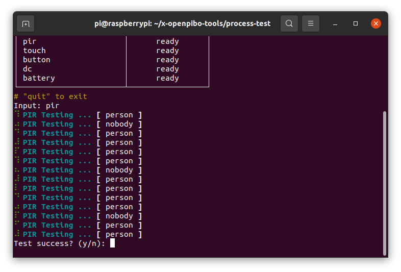

# Tools `x 

> 파이보 사용에 도움이 되는 각종 도구입니다.
>
> - process-test
>   - For Part test
>
> - motion-creator
>   - motion create using web service
>   - under construction
> - device-simulator
>   - device control using web service


## Process Test

> 파이보 부품들의 정상 동작 여부를 테스트하는 프로그램입니다.
>

__사용 방법__

```python
>>> cd ~/x-openpibo-tools/process-test
>>> sudo python3 main.py
```


### Command

- **oled** : OLED 패널을 테스트합니다.
  
  - 파이보 OLED 화면에 `Oled Testing...` 이라고 출력
  
  


- **audio** : 스피커를 테스트합니다.
  - 5초간 음악 재생 -> 2초 음소거 -> 5초간 음악 재생 -> 음악 중지


- **motor** : 서보모터의 작동을 테스트합니다.

  모터당 3회씩 동작하며, 하나라도 작동이 안되면 실패 입니다.

  순서는 아래와 같습니다.

  1. `foot_right`
  2. `leg_right`
  3. `shoulder_right`
  4. `hand_right`
  5. `head_pan`
  6. `head_tilt`
  7. `foot_left`
  8. `leg_left`
  9. `shoulder_left`
  10. `hand_left`


- **mic** : 마이크를 테스트합니다.

  1. 5초간 음성을 녹음합니다.

     (아래 화면이 출력됩니다)

     

  2. 5초 뒤 녹음한 음성이 그대로 출력되는지 확인합니다.

     

- **camera** : 카메라를 테스트합니다.

  OLED 화면에 5초간 카메라 캡쳐 이미지 출력 후 꺼짐

  


- **neopixel** : LED (파이보 눈) 를 테스트합니다.

  R -> G -> B 순서대로 변함 (각 2초씩)

  


- **pir** : PIR 센서를 테스트합니다.

  20초간 테스트 진행, 1초마다 테스트 메시지 출력

  - 파이보 앞에 사람이 있으면 `[ person ]` 메시지 출력

  - 사람이 없으면 `[ nobody ]` 메시지가 출력되며, 다시 사람이 올때까지 메시지 출력 중지

  (테스트 결과는 아래 화면처럼 출력됩니다)

  

  

- **touch** : 터치센서를 테스트합니다.

  10초간 테스트 진행, 1초마다 테스트 메시지 출력

  - 파이보 이마를 쓰다듬으면 `[ touch ]` 메시지 출력

    단, 계속 쓰다듬으면 소용이 없고, 쓰다듬기 시작할때만 출력

  - 이마를 쓰다듬지 않으면 `[ No signal ]` 메시지 출력

  (테스트 결과는 아래 화면처럼 출력됩니다)

  

  

- **button** : 전원 버튼을 테스트합니다.

  10초간 진행, 1초마다 테스트 메시지 출력

  - 전원버튼을 누르고 있으면 `[ on ]` 메시지 출력

    (한번만 눌렀다 떼면 신호를 감지하지 못 함)

  - 전원버튼을 누르지 않으면 `[ No signal ]` 메시지 출력

  (테스트 결과는 아래 화면처럼 출력됩니다)

  

  

- **dc** : 충전기 연결상태를 테스트합니다.

  10초간 진행, 1초마다 테스트 메시지 출력

  - 충전기를 연결할 때 `[ on ]` 메시지 출력
  - 충전기 연결을 해제할 때 `[ off ]` 메시지 출력
  - 충전기 연결상태에 변화가 없을 때 `[ No signal ]` 메시지 출력

  (테스트 결과는 아래 화면처럼 출력됩니다)

  

  

- **battery** : 배터리를 테스트합니다.

  배터리 잔량 화면에 표시

  (테스트 결과)

  

  

- **quit** : 테스트를 종료합니다.

  테스트 종료 및 테스트 결과 반환

  


## Motion Creator

> 파이보의 동작을 생성하는 툴 입니다.
>
> `Chrome` 브라우저 사용을 권장합니다.

__사용 방법__

```python
>>> cd ~/x-openpibo-tools/motion-creator
>>> sudo python3 main.py --port 8888
```

- 프로그램을 시작합니다.

  `--port` : 연결할 포트를 입력합니다. 만약 설정하지 않으면, 기본 포트는 `8888`입니다.
  
  
  
  
  
  이후 `http://<PIBO IP>:<PORT>`에 접속합니다.
  
  (출력된 주소를 `ctrl + click` 해도 됩니다)


- 모션을 생성합니다.

  

  
  
  - 왼쪽은 모터를 제어하는 부분이고, 오른쪽은 저장된 모션이 보여지는 부분입니다.
  
  - 왼쪽의 입력값을 조작하면 파이보의 모터가 실시간으로 움직입니다.
  
  - 시간을 설정하고 아래 저장 버튼을 누르면 오른쪽 테이블에 동작 하나가 추가됩니다.
  
    (시간은 50ms 간격으로 설정할 수 있습니다.)
  
    
  
    
  
  - 동작테이블 각 행에 마우스를 올리면 빨간색으로 변하고, 클릭하면 해당 동작이 삭제됩니다.
  
    
  
    
  
  - 동작을 테스트하려면, 우측 상단의 `재생` 버튼을 누릅니다.
  
    `cycle` 을 설정해 여러번 반복할 수도 있습니다. (cycle이 3이면, 동작이 3번 반복됩니다.)
  
    
  
    
  
  - 우측 하단 입력창에 모션 이름을 적고 `Export` 버튼을 누르면, 코드가 생성됩니다.
  
    
  
    또한 `/motion-creator/` 경로에 `<모션 이름>.json` 의 이름으로도 저장된 것을 확인할 수 있습니다.
  
    
  
    
  
  - 우측 상단의 `초기화` 버튼을 누르면, 기록했던 동작들이 모두 초기화됩니다.
  
    
  
    
  
- 생성한 모션을 사용합니다.

  ```python
  >>> from openpibo.motion import Motion
  
  >>> pibo_motion = Motion()
  >>> pibo_motion.set_profile('hello.json')	 # 생성된 json 파일 경로 입력
  >>> pibo_motion.get_motion()				 # ['hello']
  
  >>> pibo_motion.set_motion('hello')			 # 동작 실행
  ```

  또는 생성한 파일에서 코드를 복사해서 사용할 수 있습니다.


## Device Simulator

> 파이보의 device를 제어할 수 있는 툴 입니다.
>
> 디바이스 부품(neopixel, battery, dc, button, pir, touch)을 제어하거나 상태를 확인할 수 있습니다.
>
> `Chrome` 브라우저 사용을 권장합니다.

__사용 방법__

```python
cd ~/x-openpibo-tools/device-test
sudo python3 main.py --port 8888
```

- 프로그램을 실행합니다.

  `--port` : 연결할 포트를 입력합니다. 만약 설정하지 않으면, 기본 포트는 `8888`입니다.

  이후 `http://<PIBO IP>:8888`에 접속

  

  

- 죄측 입력 바를 조작하여 **Neopixel** 을 제어할 수 있습니다.

  

  

  

- 우측 테이블에서는 디바이스 상태 정보를 확인할 수 있습니다.

  상단부터 배터리 잔량, 전원케이블 연결 상태, 전원버튼 누름상태, PIR센서 신호, 터치센서 신호를 나타냅니다.
