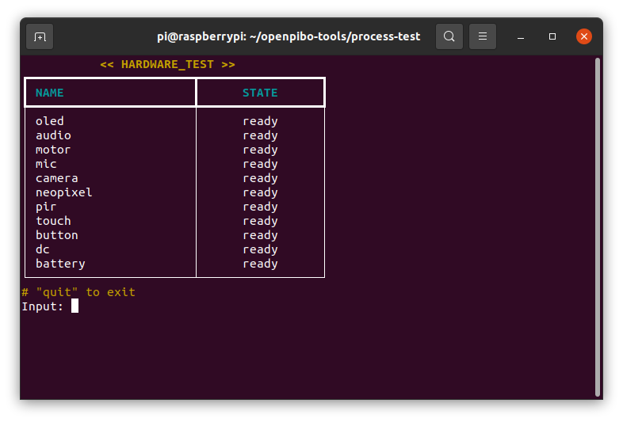
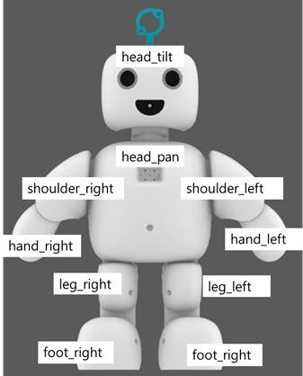

# Pibo H/W Tester

> 파이보를 올바르게 조립하였는지 테스트하기 위한 프로그램 입니다.


## 테스트 진행방법

```shell
cd ~/openpibo-tools/process-test
```

> `~/openpibo-tools/process-test` 경로에 접속합니다.

```shell
sudo python3 main.py
```

> `main.py` 파일을 실행합니다.
>
> 그러면 아래 화면이 나옵니다.



입력할 수 있는 커멘드는 위 테이블의 `NAME`과 같습니다.

각 커멘드를 입력했을 시 평가해야 하는 내용입니다.

- __oled:__

  pibo 가슴에 위치한 oled 화면에 `Oled testing...` 가 출력되는지 확인합니다.

- __audio:__

  pibo에서 5초간 음악이 흘러나오는지 확인합니다.

  이후 2초간 mute되었다가, 다시 5초간 음악이 흘러나오는지 확인합니다.

- __motor:__

  파이보의 각 부품이 올바른 순서로 작동하는지 확인합니다.
  작동 순서는 아래와 같습니다.

  1. `foot_right`
  2. `leg_right`
  3. `shoulder_right`
  4. `hand_right`
  5. `head_pan`
  6. `head_tilt`
  7. `foot_left`
  8. `leg_left`
  9. `shoulder_left`
  10. `hand_left`

  

- __mic:__

  5초간 음성을 녹음합니다.
  이후 5초간 녹음한 음성이 출력되는지 확인합니다.

- __camera:__

  pibo의 가슴에 있는 oled에 카메라 화면이 정상적으로 나타나는지 확인합니다.

- __neopixel:__

  pibo의 눈이 `빨강 - 초록 - 파랑` 순으로 변하는지 확인합니다.

- __pir:__

  20초간 테스트합니다.
  PIR센서 앞에 사람이 나타나거나 사라지면 `person`이 출력되는지 확인합니다.
  PIR센서 앞에 사람이 3초 이상 없거나 3초 이상 있으면 `nobody`가 출력되는지 확인합니다.

- __touch:__

  10초간 테스트합니다.
  pibo의 이마를 문지르면 `touch`가 출력되는지 확인합니다.

- __button:__

  10초간 테스트합니다.
  pibo의 전원 버튼을 누르면 `on`이 출력되는지 확인합니다.
  1초에 한번씩 출력값이 나타나는데, 이때 버튼을 누른 상태여야 합니다.

- __dc:__

  10초간 테스트합니다.
  어댑터 전원 케이블을 연결하면 `on`, 연결 해제하면 `off`가 출력되는지 확인합니다.

- __battery:__

  현재 배터리 잔량이 출력되는지 확인합니다.


각 테스트가 끝나고 나면 `Test success? (y/n):` 라는 메시지가 출력됩니다.

테스트가 잘 되었다면 `y`, 잘 안되었다면 `n`를 입력합니다.


모든 테스트가 마무리되면 `quit` 커멘드를 입력하여 테스트를 종료합니다.
